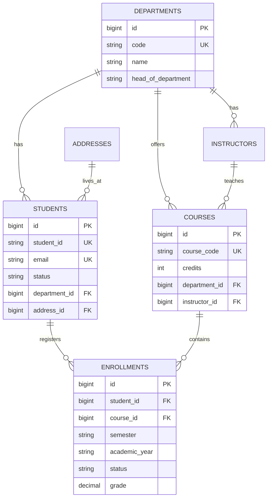

# Student Management System — Repository Layer Documentation

A Spring Boot 3.2 + Spring Data JPA application for managing students, departments, courses, instructors, addresses, and enrollments. This document explains **how the repository layer works**, the **request/data flow**, and **every custom repository method** in detail.

---

## Table of Contents

1. [Project Overview](#1-project-overview)
2. [Technology Stack](#2-technology-stack)
3. [Project Structure](#3-project-structure)
4. [Database & Entity Relationships](#4-database--entity-relationships)
5. [How the Repository Layer Works (Flow)](#5-how-the-repository-layer-works-flow)
6. [Query Types Explained](#6-query-types-explained)
7. [Built-in Methods (JpaRepository)](#7-built-in-methods-jparepository)
8. [AddressRepository](#8-addressrepository)
9. [DepartmentRepository](#9-departmentrepository)
10. [InstructorRepository](#10-instructorrepository)
11. [CourseRepository](#11-courserepository)
12. [StudentRepository](#12-studentrepository)
13. [EnrollmentRepository](#13-enrollmentrepository)
14. [Pagination Usage](#14-pagination-usage)
15. [JpaSpecificationExecutor (Dynamic Queries)](#15-jpaspecificationexecutor-dynamic-queries)
16. [Setup & Run](#16-setup--run)
17. [Important Notes](#17-important-notes)

---

## 1. Project Overview

This project is a **Student Management System** backend. The **repository layer** is the data-access layer. It sits between your business logic (services) and the MySQL database.

```
┌─────────────┐     ┌─────────────┐     ┌──────────────────┐     ┌──────────┐
│  Controller │ ──► │   Service   │ ──► │   Repository     │ ──► │  MySQL   │
│  (future)   │     │  (future)   │     │  (this project)  │     │ Database │
└─────────────┘     └─────────────┘     └──────────────────┘     └──────────┘
```

**What repositories do:**
- Save, read, update, and delete records
- Run custom searches (by email, status, department, etc.)
- Run aggregate queries (count, average grade, sum credits)
- Support pagination for large result sets

You **do not write SQL manually** for most operations. Spring Data JPA generates queries from method names or runs your `@Query` annotations.

---

## 2. Technology Stack

| Technology | Version | Purpose |
|---|---|---|
| Java | 21 | Programming language |
| Spring Boot | 3.2.5 | Application framework |
| Spring Data JPA | (via starter) | Repository & ORM layer |
| Hibernate | (via JPA) | Maps Java entities to SQL tables |
| MySQL | 8.x | Relational database |
| Lombok | 1.18.38 | Reduces boilerplate in some entities |
| Maven | — | Build tool |

---

## 3. Project Structure

```
src/main/java/com/studentmanagement/
├── StudentManagementApplication.java    # Main entry point
├── model/                               # JPA entities (database tables)
│   ├── Address.java
│   ├── Department.java
│   ├── Instructor.java
│   ├── Course.java
│   ├── Student.java
│   ├── Enrollment.java
│   └── enums/
│       ├── Gender.java
│       ├── StudentStatus.java
│       └── EnrollmentStatus.java
└── repository/                          # Data access interfaces
    ├── AddressRepository.java
    ├── DepartmentRepository.java
    ├── InstructorRepository.java
    ├── CourseRepository.java
    ├── StudentRepository.java
    └── EnrollmentRepository.java
```

---

## 4. Database & Entity Relationships



### Entity → Table mapping

| Java Entity | Database Table | Primary Key |
|---|---|---|
| `Address` | `addresses` | `id` (auto-increment) |
| `Department` | `departments` | `id` |
| `Instructor` | `instructors` | `id` |
| `Course` | `courses` | `id` |
| `Student` | `students` | `id` |
| `Enrollment` | `enrollments` | `id` |

### Enums used in queries

| Enum | Values | Used in |
|---|---|---|
| `StudentStatus` | `ACTIVE`, `INACTIVE`, `GRADUATED`, `SUSPENDED` | `Student` |
| `Gender` | (see `Gender.java`) | `Student` |
| `EnrollmentStatus` | `ENROLLED`, `COMPLETED`, `DROPPED`, `FAILED` | `Enrollment` |

---

## 5. How the Repository Layer Works (Flow)

### Step-by-step flow when you call a repository method

```
1. Application starts
   └── Spring scans @Repository interfaces
   └── Spring creates proxy implementations at runtime

2. You inject a repository (e.g. @Autowired StudentRepository)

3. You call a method, e.g. studentRepository.findByEmail("john@example.com")

4. Spring Data JPA decides how to run the query:
   ├── Derived method name  → auto-generates SQL from method name
   ├── @Query (JPQL)        → translates entity query to SQL
   ├── @Query (native)      → runs raw SQL on MySQL
   └── JpaRepository method → uses built-in CRUD logic

5. Hibernate executes SQL against MySQL

6. Result is mapped back to Java objects (entities) and returned
```

### Example flow: Find student by email

```java
@Autowired
StudentRepository studentRepository;

Optional<Student> student = studentRepository.findByEmail("john@example.com");
```

**What happens internally:**

1. Spring sees method name `findByEmail`
2. Parses: `find` + `By` + `Email`
3. Generates SQL similar to:
   ```sql
   SELECT * FROM students WHERE email = ?
   ```
4. Binds parameter `"john@example.com"`
5. Maps row to `Student` object
6. Wraps in `Optional` (empty if not found)

### Example flow: Custom JPQL update

```java
int updated = studentRepository.updateStatusById(1L, StudentStatus.GRADUATED);
```

**What happens internally:**

1. `@Modifying` tells Spring this is UPDATE/DELETE (not SELECT)
2. `@Transactional` starts a database transaction
3. JPQL `UPDATE Student s SET s.status = :status WHERE s.id = :id` runs
4. Returns number of rows affected (`int`)

---

## 6. Query Types Explained

Every repository in this project uses **five query styles**:

### 6.1 Derived Query Methods (Method Name Convention)

You only write the method name. Spring builds the SQL.

| Method name pattern | Generated SQL logic |
|---|---|
| `findByEmail(String email)` | `WHERE email = ?` |
| `findByStatusAndGender(...)` | `WHERE status = ? AND gender = ?` |
| `findByFirstNameContainingIgnoreCase(...)` | `WHERE LOWER(first_name) LIKE LOWER('%?%')` |
| `findByEnrollmentDateAfter(date)` | `WHERE enrollment_date > ?` |
| `findByEnrollmentDateBetween(a, b)` | `WHERE enrollment_date BETWEEN ? AND ?` |
| `findByDepartment_Code(code)` | `JOIN departments WHERE code = ?` (nested property) |
| `findByStatusOrderByLastNameAsc(...)` | `WHERE status = ? ORDER BY last_name ASC` |
| `countByStatus(...)` | `SELECT COUNT(*) WHERE status = ?` |
| `existsByEmail(...)` | `SELECT EXISTS(...) WHERE email = ?` |
| `findByPhoneIsNotNull()` | `WHERE phone IS NOT NULL` |
| `findByStatusIn(list)` | `WHERE status IN (...)` |

**Return types:**
- `Optional<T>` — zero or one result (safe, no null pointer)
- `List<T>` — zero or many results
- `Page<T>` — paginated results + metadata
- `long` / `boolean` — for count/exists
- `int` — for `@Modifying` (rows affected)

### 6.2 JPQL `@Query` (Java Persistence Query Language)

Uses **entity names** and **field names**, not table/column names.

```java
@Query("SELECT s FROM Student s WHERE s.enrollmentDate >= :fromDate")
List<Student> findEnrolledOnOrAfter(@Param("fromDate") LocalDate fromDate);
```

- `Student` = entity class name (not `students` table)
- `s.enrollmentDate` = Java field (maps to `enrollment_date` column)
- `:fromDate` = named parameter bound via `@Param`

**Best for:** joins across entities, complex conditions, aggregates (`COUNT`, `AVG`, `SUM`).

### 6.3 Native SQL `@Query`

Uses real **table and column names** from MySQL.

```java
@Query(value = "SELECT * FROM students WHERE status = :status", nativeQuery = true)
List<Student> findByStatusNative(@Param("status") String status);
```

**Best for:** database-specific SQL, complex joins, `LIMIT`, performance tuning.

### 6.4 `@Modifying` Queries

Used for **UPDATE** and **DELETE**. Always paired with `@Transactional`.

```java
@Modifying
@Transactional
@Query("UPDATE Student s SET s.status = :status WHERE s.id = :id")
int updateStatusById(@Param("id") Long id, @Param("status") StudentStatus status);
```

Returns `int` = number of rows updated/deleted.

### 6.5 `JpaSpecificationExecutor`

Enables **dynamic filters** built at runtime (not fixed method names). Used from a service layer later:

```java
// Example (in a future service class):
Specification<Student> spec = (root, query, cb) ->
    cb.equal(root.get("status"), StudentStatus.ACTIVE);
Page<Student> page = studentRepository.findAll(spec, PageRequest.of(0, 10));
```

---

## 7. Built-in Methods (JpaRepository)

Every repository extends `JpaRepository<Entity, Long>`, which provides these methods automatically (no need to declare them):

| Method | Description |
|---|---|
| `save(entity)` | Insert new or update existing record |
| `saveAll(entities)` | Batch save |
| `findById(id)` | Find by primary key → `Optional<Entity>` |
| `findAll()` | Get all records |
| `findAllById(ids)` | Get multiple by IDs |
| `count()` | Total record count |
| `existsById(id)` | Check if ID exists |
| `deleteById(id)` | Delete by ID |
| `delete(entity)` | Delete entity |
| `deleteAll()` | Delete all records |
| `flush()` | Force pending changes to database |
| `saveAndFlush(entity)` | Save and immediately flush |

**Example:**
```java
Student student = new Student();
student.setStudentId("STU001");
student.setFirstName("John");
student.setEmail("john@example.com");
studentRepository.save(student);  // INSERT

student.setPhone("9999999999");
studentRepository.save(student);  // UPDATE (same id)
```

---

## 8. AddressRepository

**Entity:** `Address`  
**Table:** `addresses`  
**File:** `repository/AddressRepository.java`

### Inherited
`JpaRepository<Address, Long>` + `JpaSpecificationExecutor<Address>`

### Derived — Find methods

| Method | Parameters | Returns | What it does |
|---|---|---|---|
| `findByCityAndState` | `city`, `state` | `Optional<Address>` | Exact match on city AND state |
| `findByStreetAndCityAndPostalCode` | `street`, `city`, `postalCode` | `Optional<Address>` | Unique address lookup |
| `findByCountryIgnoreCase` | `country` | `List<Address>` | All addresses in a country (case-insensitive) |
| `findByCityContainingIgnoreCase` | `cityPart` | `List<Address>` | Cities containing text, e.g. `"mum"` → Mumbai |
| `findByPostalCodeStartingWith` | `prefix` | `List<Address>` | PIN codes starting with prefix, e.g. `"400"` |
| `findByStateOrderByCityAsc` | `state` | `List<Address>` | Addresses in a state, sorted by city A→Z |

### Derived — Count & Exists

| Method | Returns | What it does |
|---|---|---|
| `countByCountry` | `long` | How many addresses in a country |
| `existsByCityAndPostalCode` | `boolean` | `true` if that city+PIN combo exists |
| `existsByStreetAndCity` | `boolean` | `true` if street+city combo exists |

### Derived — Pagination

| Method | Returns | What it does |
|---|---|---|
| `findByState` | `Page<Address>` | Paginated addresses for a state |

### JPQL methods

| Method | What it does |
|---|---|
| `findByPostalCode` | Find single address by exact postal code |
| `findByCityAndCountryOrderByStreet` | Addresses in city+country, sorted by street |
| `findByCountryAndStates` | Addresses in a country where state is in a given list |

### Native SQL methods

| Method | What it does |
|---|---|
| `findByStateNative` | Raw SQL: all addresses in a state |
| `searchByCityOrStreetNative` | Search keyword in city OR street columns |

### Modifying methods

| Method | Returns | What it does |
|---|---|---|
| `updateCountryById` | `int` | Change country for one address by ID |
| `deleteByCityAndState` | `int` | Delete all addresses matching city+state |

---

## 9. DepartmentRepository

**Entity:** `Department`  
**Table:** `departments`  
**File:** `repository/DepartmentRepository.java`

### Derived — Find methods

| Method | Parameters | Returns | What it does |
|---|---|---|---|
| `findByCode` | `code` | `Optional<Department>` | Find department by unique code, e.g. `"CS"` |
| `findByName` | `name` | `Optional<Department>` | Exact name match |
| `findByNameContainingIgnoreCase` | `namePart` | `List<Department>` | Partial name search |
| `findByHeadOfDepartment` | `headName` | `List<Department>` | Departments led by a person |
| `findByCodeIn` | `List<String> codes` | `List<Department>` | Departments whose code is in the list |
| `findAllByOrderByNameAsc` | — | `List<Department>` | All departments sorted A→Z by name |

### Derived — Count & Exists

| Method | Returns | What it does |
|---|---|---|
| `existsByCode` | `boolean` | Check if department code already exists |
| `existsByNameIgnoreCase` | `boolean` | Check if name exists (case-insensitive) |
| `countByHeadOfDepartmentIsNotNull` | `long` | Count departments that have a head assigned |

### Derived — Pagination

| Method | Returns | What it does |
|---|---|---|
| `findByNameContaining` | `Page<Department>` | Paginated partial name search |

### JPQL methods

| Method | What it does |
|---|---|
| `findAllWithDescription` | Departments that have a non-empty description |
| `searchByNameOrCode` | Keyword search in name OR code |
| `findDepartmentsWithoutHead` | Departments where `headOfDepartment` is null |

### Native SQL methods

| Method | What it does |
|---|---|
| `findByCodeNative` | Raw SQL lookup by code |
| `countDepartmentsWithHeadNative` | Count departments with a head (native) |

### Modifying methods

| Method | Returns | What it does |
|---|---|---|
| `updateHeadOfDepartment` | `int` | Set head of department by department ID |
| `updateDescriptionByCode` | `int` | Update description using department code |

---

## 10. InstructorRepository

**Entity:** `Instructor`  
**Table:** `instructors`  
**File:** `repository/InstructorRepository.java`

### Derived — Find methods

| Method | Parameters | Returns | What it does |
|---|---|---|---|
| `findByEmployeeId` | `employeeId` | `Optional<Instructor>` | Find by unique employee ID |
| `findByEmail` | `email` | `Optional<Instructor>` | Find by email |
| `findByFirstNameAndLastName` | `firstName`, `lastName` | `List<Instructor>` | Full name match |
| `findByLastNameContainingIgnoreCase` | `lastName` | `List<Instructor>` | Partial last name search |
| `findBySpecializationContainingIgnoreCase` | `specialization` | `List<Instructor>` | e.g. find all "Data Science" instructors |
| `findByDepartment_Id` | `departmentId` | `List<Instructor>` | All instructors in a department (by ID) |
| `findByDepartment_Code` | `departmentCode` | `List<Instructor>` | All instructors in dept by code |
| `findByDepartment_IdOrderByLastNameAsc` | `departmentId` | `List<Instructor>` | Dept instructors sorted by last name |

### Derived — Count & Exists

| Method | Returns | What it does |
|---|---|---|
| `existsByEmail` | `boolean` | Email already registered? |
| `existsByEmployeeId` | `boolean` | Employee ID already exists? |
| `countByDepartment_Id` | `long` | Number of instructors in a department |

### Derived — Pagination

| Method | Returns | What it does |
|---|---|---|
| `findByDepartment_Code` | `Page<Instructor>` | Paginated instructors by department code |

### JPQL methods

| Method | What it does |
|---|---|
| `findByDepartmentCodeWithSpecialization` | Instructors in a dept who have a specialization set |
| `findByCourseCode` | Find the instructor teaching a specific course |
| `searchByName` | Search first or last name by keyword |
| `countCoursesByInstructorId` | How many courses an instructor teaches |

### Native SQL methods

| Method | What it does |
|---|---|
| `findByDepartmentCodeNative` | Join instructors + departments, filter by dept code |
| `findByEmailDomainNative` | Find instructors whose email ends with a domain, e.g. `@university.edu` |

### Modifying methods

| Method | Returns | What it does |
|---|---|---|
| `updatePhoneById` | `int` | Update phone number by instructor ID |
| `updateSpecializationByEmployeeId` | `int` | Update specialization by employee ID |

---

## 11. CourseRepository

**Entity:** `Course`  
**Table:** `courses`  
**File:** `repository/CourseRepository.java`

### Derived — Find methods

| Method | Parameters | Returns | What it does |
|---|---|---|---|
| `findByCourseCode` | `courseCode` | `Optional<Course>` | Find course by unique code, e.g. `"CS101"` |
| `findByCourseNameContainingIgnoreCase` | `courseName` | `List<Course>` | Partial course name search |
| `findBySemesterAndAcademicYear` | `semester`, `academicYear` | `List<Course>` | All courses in a term |
| `findByCreditsGreaterThanEqual` | `credits` | `List<Course>` | Courses with credits >= value |
| `findByCreditsBetween` | `min`, `max` | `List<Course>` | Courses within credit range |
| `findByDepartment_Id` | `departmentId` | `List<Course>` | Courses in a department |
| `findByDepartment_Code` | `departmentCode` | `List<Course>` | Courses by department code |
| `findByInstructor_Id` | `instructorId` | `List<Course>` | Courses taught by an instructor |
| `findByDepartment_CodeAndSemester` | `code`, `semester` | `List<Course>` | Dept courses in a semester |
| `findByAcademicYearOrderByCourseNameAsc` | `academicYear` | `List<Course>` | Year's courses sorted by name |

### Derived — Count & Exists

| Method | Returns | What it does |
|---|---|---|
| `existsByCourseCode` | `boolean` | Course code already exists? |
| `countByDepartment_Id` | `long` | Total courses in a department |
| `countByInstructor_Id` | `long` | Total courses for an instructor |

### Derived — Pagination

| Method | Returns | What it does |
|---|---|---|
| `findByDepartment_Code` | `Page<Course>` | Paginated courses by department |
| `findBySemesterAndAcademicYear` | `Page<Course>` | Paginated courses for a term |

### JPQL methods

| Method | What it does |
|---|---|
| `findByDepartmentCodeAndMinCredits` | Dept courses with minimum credit threshold |
| `findByInstructorEmployeeId` | Courses taught by instructor employee ID |
| `findByTermOrderByCreditsDesc` | Term courses sorted highest credits first |
| `sumCreditsByDepartmentId` | Total credits offered by a department |
| `findCoursesWithNoEnrollments` | Courses with zero student enrollments |

### Native SQL methods

| Method | What it does |
|---|---|
| `findByCourseCodeNative` | Raw SQL lookup by course code |
| `findByDepartmentAndSemesterNative` | Join courses + departments by code and semester |
| `findTopByCreditsForYearNative` | Top N highest-credit courses for an academic year |

### Modifying methods

| Method | Returns | What it does |
|---|---|---|
| `assignInstructor` | `int` | Assign/reassign instructor to a course |
| `updateDescriptionByCourseCode` | `int` | Update course description by code |

---

## 12. StudentRepository

**Entity:** `Student`  
**Table:** `students`  
**File:** `repository/StudentRepository.java`

### Derived — Find methods

| Method | Parameters | Returns | What it does |
|---|---|---|---|
| `findByStudentId` | `studentId` | `Optional<Student>` | Find by unique student ID string |
| `findByEmail` | `email` | `Optional<Student>` | Find by email (safe Optional) |
| `findStudentByEmail` | `email` | `Student` | Find by email (returns null if not found) |
| `findByFirstNameAndLastName` | `firstName`, `lastName` | `List<Student>` | Exact full name |
| `findByStatus` | `status` | `List<Student>` | All students with a status |
| `findByStatusIn` | `List<StudentStatus>` | `List<Student>` | Students with status in list |
| `findByStatusAndGender` | `status`, `gender` | `List<Student>` | Filter by status AND gender |
| `findByGender` | `gender` | `List<Student>` | All students of a gender |
| `findByFirstNameContainingIgnoreCase` | `firstName` | `List<Student>` | Partial first name search |
| `findByLastNameStartingWithIgnoreCase` | `prefix` | `List<Student>` | Last names starting with prefix |
| `findByEmailEndingWith` | `domain` | `List<Student>` | e.g. emails ending with `@gmail.com` |
| `findByPhoneIsNotNull` | — | `List<Student>` | Students who have a phone number |
| `findByDepartment_Id` | `departmentId` | `List<Student>` | Students in department by ID |
| `findByDepartment_Code` | `departmentCode` | `List<Student>` | Students in department by code |
| `findByAddress_City` | `city` | `List<Student>` | Students living in a city |
| `findByAddress_State` | `state` | `List<Student>` | Students in a state |
| `findByEnrollmentDateAfter` | `date` | `List<Student>` | Enrolled after a date |
| `findByEnrollmentDateBetween` | `start`, `end` | `List<Student>` | Enrolled in date range |
| `findByDateOfBirthBefore` | `date` | `List<Student>` | Born before a date |
| `findByStatusOrderByLastNameAscFirstNameAsc` | `status` | `List<Student>` | Sorted by last then first name |
| `findByDepartment_CodeOrderByEnrollmentDateDesc` | `code` | `List<Student>` | Dept students, newest enrollment first |

### Derived — Count & Exists

| Method | Returns | What it does |
|---|---|---|
| `countByStatus` | `long` | Count students by status |
| `countByDepartment_Id` | `long` | Count students in a department |
| `countByGender` | `long` | Count students by gender |
| `existsByEmail` | `boolean` | Email already taken? |
| `existsByStudentId` | `boolean` | Student ID already exists? |
| `existsByPhone` | `boolean` | Phone number already registered? |

### Derived — Pagination

| Method | Returns | What it does |
|---|---|---|
| `findByStatus` | `Page<Student>` | Paginated students by status |
| `findByDepartment_Code` | `Page<Student>` | Paginated students by department |
| `findByFirstNameContainingIgnoreCase` | `Page<Student>` | Paginated name search |

### JPQL methods

| Method | What it does |
|---|---|
| `findEnrolledOnOrAfter` | Students enrolled on or after a date |
| `findByAddressCity` | Join student → address, filter by city |
| `findByStatusAndLastNameLike` | Status + partial last name match |
| `searchByKeyword` | Search first name, last name, or email |
| `findByDepartmentCodeAndStatus` | Department code + status combined filter |
| `findStudentsWithoutDepartment` | Students not assigned to any department |
| `countByAddressCity` | Count students in a specific city |

### Native SQL methods

| Method | What it does |
|---|---|
| `findByStatusNative` | Raw SQL filter by status string |
| `findByAddressStateNative` | Join students + addresses by state |
| `findByDepartmentCodeNative` | Join students + departments by code |
| `countStudentsWithEnrollmentStatusNative` | Count students with a given enrollment status |

### Modifying methods

| Method | Returns | What it does |
|---|---|---|
| `updateStatusById` | `int` | Change student status by database ID |
| `updatePhoneByStudentId` | `int` | Update phone by student ID string |
| `assignDepartment` | `int` | Assign student to a department |
| `deleteByStatus` | `int` | Delete all students with a given status |

---

## 13. EnrollmentRepository

**Entity:** `Enrollment`  
**Table:** `enrollments`  
**File:** `repository/EnrollmentRepository.java`

Enrollments link a **Student** to a **Course** for a specific **semester** and **academic year**. There is a unique constraint: one student cannot enroll in the same course twice in the same term.

### Derived — Find methods

| Method | Parameters | Returns | What it does |
|---|---|---|---|
| `findByStudent_Id` | `studentId` | `List<Enrollment>` | All enrollments for a student |
| `findByCourse_Id` | `courseId` | `List<Enrollment>` | All enrollments for a course |
| `findByStudent_IdAndStatus` | `studentId`, `status` | `List<Enrollment>` | Student enrollments by status |
| `findByCourse_IdAndStatus` | `courseId`, `status` | `List<Enrollment>` | Course enrollments by status |
| `findBySemesterAndAcademicYear` | `semester`, `year` | `List<Enrollment>` | All enrollments in a term |
| `findByStatus` | `status` | `List<Enrollment>` | All enrollments with a status |
| `findByGradeGreaterThanEqual` | `minGrade` | `List<Enrollment>` | Enrollments with grade >= value |
| `findByEnrollmentDateBetween` | `start`, `end` | `List<Enrollment>` | Enrollments in date range |
| `findByStudent_IdAndCourse_IdAndSemesterAndAcademicYear` | 4 params | `Optional<Enrollment>` | Exact enrollment lookup |
| `findByStudent_StudentIdAndAcademicYear` | `studentId`, `year` | `List<Enrollment>` | By student code string + year |
| `findByCourse_CourseCode` | `courseCode` | `List<Enrollment>` | Enrollments for a course code |

### Derived — Count & Exists

| Method | Returns | What it does |
|---|---|---|
| `existsByStudent_IdAndCourse_IdAndSemesterAndAcademicYear` | `boolean` | Already enrolled in this course this term? |
| `countByCourse_IdAndStatus` | `long` | Count enrollments for course + status |
| `countByStudent_Id` | `long` | Total enrollments for a student |

### Derived — Pagination

| Method | Returns | What it does |
|---|---|---|
| `findByStudent_Id` | `Page<Enrollment>` | Paginated student enrollments |
| `findByCourse_IdAndStatus` | `Page<Enrollment>` | Paginated course enrollments by status |

### JPQL methods

| Method | What it does |
|---|---|
| `findStudentEnrollmentsByStatus` | Student enrollments by status, newest first |
| `findGradedEnrollmentsByCourse` | Graded enrollments for a course, highest grade first |
| `averageGradeByCourseId` | Average numeric grade for a course |
| `findByStudentDepartmentAndYear` | Enrollments for students in a dept for a year |
| `countEnrollmentsByCourseAndStatus` | Count enrollments per course and status |

### Native SQL methods

| Method | What it does |
|---|---|
| `findByStudentCodeAndYearNative` | Join enrollments + students by student code |
| `findByCourseCodeAndStatusNative` | Join enrollments + courses by course code |
| `averageGradeByCourseIdNative` | Average grade (native SQL version) |

### Modifying methods

| Method | Returns | What it does |
|---|---|---|
| `updateStatusById` | `int` | Change enrollment status |
| `updateGradeById` | `int` | Set numeric grade and letter grade |
| `bulkUpdateStatusByStudent` | `int` | Change all matching enrollments for a student |
| `deleteByCourseIdAndStatus` | `int` | Delete enrollments by course + status |

---

## 14. Pagination Usage

Repositories that return `Page<T>` need a `Pageable` argument:

```java
import org.springframework.data.domain.Page;
import org.springframework.data.domain.PageRequest;
import org.springframework.data.domain.Sort;

// Page 0, 10 records per page
Page<Student> page = studentRepository.findByStatus(
    StudentStatus.ACTIVE,
    PageRequest.of(0, 10)
);

// Page 1, 20 records, sorted by lastName
Page<Student> page2 = studentRepository.findByDepartment_Code(
    "CS",
    PageRequest.of(1, 20, Sort.by("lastName").ascending())
);

System.out.println("Total students: " + page.getTotalElements());
System.out.println("Total pages: " + page.getTotalPages());
System.out.println("Current page content: " + page.getContent());
```

| `Page` method | What it returns |
|---|---|
| `getContent()` | List of records on this page |
| `getTotalElements()` | Total records across all pages |
| `getTotalPages()` | Total number of pages |
| `getNumber()` | Current page number (0-based) |
| `hasNext()` | Is there a next page? |
| `hasPrevious()` | Is there a previous page? |

---

## 15. JpaSpecificationExecutor (Dynamic Queries)

All six repositories extend `JpaSpecificationExecutor<Entity>`. This allows building **flexible queries at runtime** when you don't know the filters in advance.

```java
import org.springframework.data.jpa.domain.Specification;
import jakarta.persistence.criteria.Predicate;
import java.util.ArrayList;
import java.util.List;

// Build dynamic query: status = ACTIVE AND city = Mumbai (optional filters)
public Specification<Student> buildStudentSpec(StudentStatus status, String city) {
    return (root, query, cb) -> {
        List<Predicate> predicates = new ArrayList<>();

        if (status != null) {
            predicates.add(cb.equal(root.get("status"), status));
        }
        if (city != null) {
            predicates.add(cb.equal(root.join("address").get("city"), city));
        }

        return cb.and(predicates.toArray(new Predicate[0]));
    };
}

// Usage:
List<Student> students = studentRepository.findAll(
    buildStudentSpec(StudentStatus.ACTIVE, "Mumbai")
);
```

---

## 16. Setup & Run

### Prerequisites
- Java 21
- MySQL 8.x running on `localhost:3306`
- Maven (or run from IntelliJ IDEA)

### Database setup

```sql
CREATE DATABASE IF NOT EXISTS student_management
    CHARACTER SET utf8mb4
    COLLATE utf8mb4_unicode_ci;
```

Or run: `database/init.sql`

### Configuration

File: `src/main/resources/application.properties`

| Property | Value | Meaning |
|---|---|---|
| `spring.datasource.url` | `jdbc:mysql://localhost:3306/student_management` | Database URL |
| `spring.jpa.hibernate.ddl-auto` | `update` | Auto-create/update tables from entities |
| `spring.jpa.show-sql` | `true` | Print SQL in console (good for learning) |

### Run the application

```bash
mvn spring-boot:run
```

Or run `StudentManagementApplication` from IntelliJ.

### Using a repository in code

```java
@Service
public class StudentService {

    private final StudentRepository studentRepository;

    public StudentService(StudentRepository studentRepository) {
        this.studentRepository = studentRepository;
    }

    public Student registerStudent(Student student) {
        if (studentRepository.existsByEmail(student.getEmail())) {
            throw new RuntimeException("Email already exists");
        }
        return studentRepository.save(student);
    }

    public List<Student> getActiveStudents() {
        return studentRepository.findByStatus(StudentStatus.ACTIVE);
    }
}
```

---

## 17. Important Notes

### `@Modifying` queries
- Always use inside a **transaction** (`@Transactional` on method or class)
- Return value is **rows affected**, not entities
- Call `entityManager.flush()` or `clear()` if you need fresh data after update

### `Optional` vs direct return
- Prefer `Optional<Student> findByEmail(...)` — avoids null pointer exceptions
- `Student findStudentByEmail(...)` returns `null` if not found — check before use:
  ```java
  Student s = studentRepository.findStudentByEmail("x@y.com");
  if (s != null) { ... }
  ```

### Lazy loading
Entities like `Student.address` and `Student.department` use `FetchType.LAZY`. Access them **inside a transaction** or they may throw `LazyInitializationException`.

### Native query column names
Native SQL uses **snake_case** column names (`first_name`, `course_code`) matching MySQL tables, not Java camelCase.

### Derived query naming rules
- Property traversal uses `_`: `findByDepartment_Code` → `department.code`
- Boolean: `IsNotNull`, `IsNull`, `True`, `False`
- Collections: `In`, `NotIn`
- Comparison: `LessThan`, `GreaterThanEqual`, `Between`
- Strings: `Containing`, `StartingWith`, `EndingWith`, `IgnoreCase`
- Sorting: `OrderByFieldNameAsc`, `OrderByFieldNameDesc`

### Total custom methods per repository

| Repository | Derived | JPQL | Native | Modifying | Total custom |
|---|---|---|---|---|---|
| AddressRepository | 10 | 3 | 2 | 2 | 17 |
| DepartmentRepository | 10 | 3 | 2 | 2 | 17 |
| InstructorRepository | 11 | 4 | 2 | 2 | 19 |
| CourseRepository | 13 | 5 | 3 | 2 | 23 |
| StudentRepository | 24 | 7 | 4 | 4 | 39 |
| EnrollmentRepository | 14 | 5 | 3 | 4 | 26 |
| **Total** | | | | | **141 custom methods** |

Plus all built-in `JpaRepository` CRUD methods on every repository.

---

## Quick Reference: Typical Business Flows

### Flow 1 — Register a new student
```
1. addressRepository.save(address)           → save address first
2. departmentRepository.findByCode("CS")     → get department
3. studentRepository.existsByEmail(email)     → check duplicate
4. student.setAddress(address)
5. student.setDepartment(department)
6. studentRepository.save(student)             → insert student
```

### Flow 2 — Enroll student in a course
```
1. studentRepository.findByStudentId("STU001")
2. courseRepository.findByCourseCode("CS101")
3. enrollmentRepository.existsByStudent_IdAndCourse_IdAndSemesterAndAcademicYear(...)
   → prevent duplicate enrollment
4. enrollmentRepository.save(enrollment)
```

### Flow 3 — Assign instructor to course
```
1. instructorRepository.findByEmployeeId("EMP001")
2. courseRepository.assignInstructor(courseId, instructorId)
   OR load course, set instructor, courseRepository.save(course)
```

### Flow 4 — Report: average grade for a course
```
1. courseRepository.findByCourseCode("CS101")
2. enrollmentRepository.averageGradeByCourseId(course.getId())
3. enrollmentRepository.countByCourse_IdAndStatus(courseId, COMPLETED)
```

---

*Generated for Student Management System — Repository Layer*
